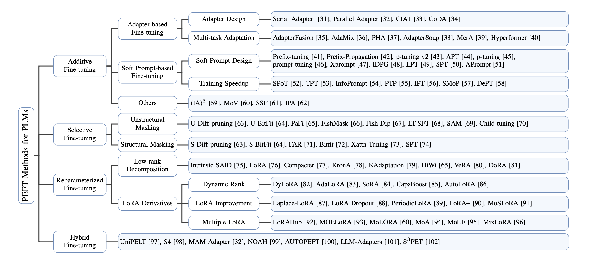

# Training Models Faster with PEFT 🚀

**PEFT (Parameter-Efficient Fine-Tuning)** enables to train models faster and more efficiently. By optimizing memory usage, computational resources, and cost, PEFT achieves high performance without unnecessary overhead.

## Key Benefits:
- 🚄 **2-5X Faster Training**: Reduce training time with parameter-efficient techniques.
- 💾 **Optimized Memory Usage**: Utilize fewer resources while maintaining performance.
- 💰 **Lower Computational Costs**: Save on infrastructure expenses with efficient computation.

## About PEFT
PEFT focuses on fine-tuning only the necessary parameters of a model, efficient training without retraining the entire model. 
# PEFT Methods for PLMs

## Methods 

| **Category**         | **Subcategory**                       | **Examples**                                                                                              |
|-----------------------|---------------------------------------|----------------------------------------------------------------------------------------------------------|
| **Additive Fine-tuning** | Adapter-based Fine-tuning           | Serial Adapter, Parallel Adapter, CIAT, CoDA                                                            |
|                       | Multi-task Adaptation                | AdapterFusion, AdaMix, PHA, AdapterSoup, MerA, Hyperformer                                              |
|                       | Soft Prompt-based Fine-tuning        | Prefix-tuning, Prefix-Propagation, p-tuning v2, APT, p-tuning, prompt-tuning, Xprompt, IDPG, LPT, SPT, APrompt |
|                       | Training Speedup                     | SPoT, TPT, InfoPrompt, PTP, IPT, SMoP, DePT                                                             |
|                       | Others                               | (IA)^3, MoV, SSF, IPA                                                                                   |
| **Selective Fine-tuning** | Unstructural Masking               | U-Diff pruning, U-BitFit, PaFi, FishMask, Fish-Dip, LT-SFT, SAM, Child-tuning                           |
|                       | Structural Masking                   | S-Diff pruning, S-BitFit, FAR, Bitfit, Xattn Tuning, SPT                                                |
| **Reparameterized Fine-tuning** | Low-rank Decomposition           | Intrinsic SAID, LoRA, Compacter, KronA, KAdaptation, HiWi, VeRA, DoRA                                   |
|                       | LoRA Derivatives                     | Dynamic Rank: DyLoRA, AdaLoRA, SoRA, CapaBoost, AutoLoRA                                                |
|                       |                                      | LoRA Improvement: Laplace-LoRA, LoRA Dropout, PeriodicLoRA, LoRA+, MoSLoRA                              |
|                       |                                      | Multiple LoRA: LoRAHub, MOELoRA, MoLORA, MoA, MoLE, MixLoRA                                             |
| **Hybrid Fine-tuning** |                                      | UniPELT, S4, MAM Adapter, NOAH, AUTOPEFT, LLM-Adapters, S^3PET                                          |

---